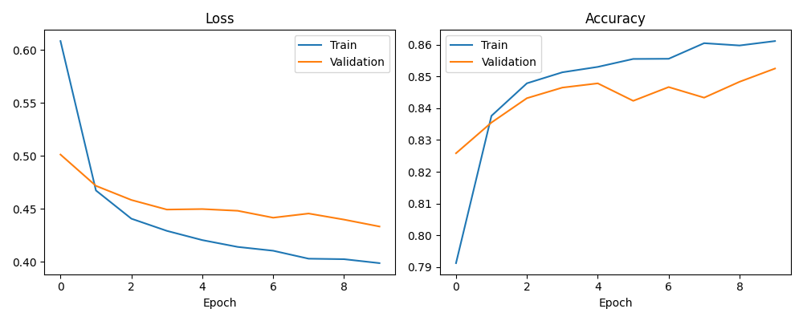
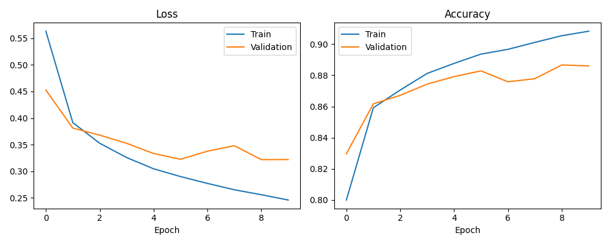
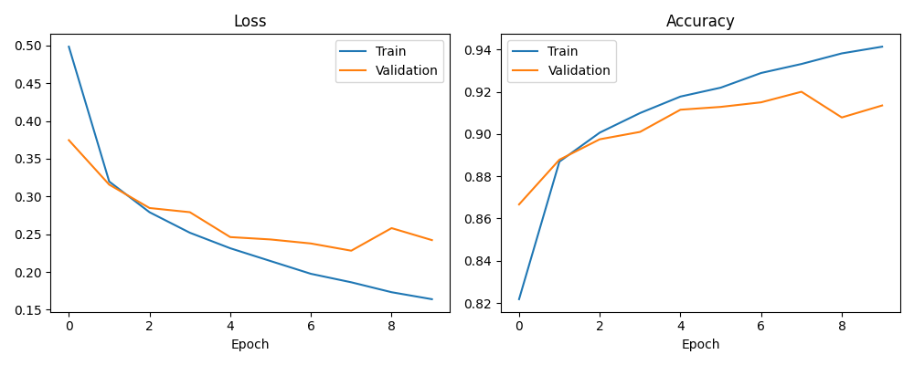
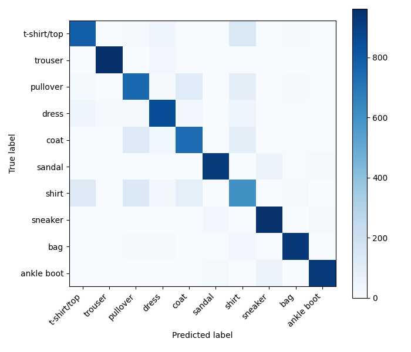
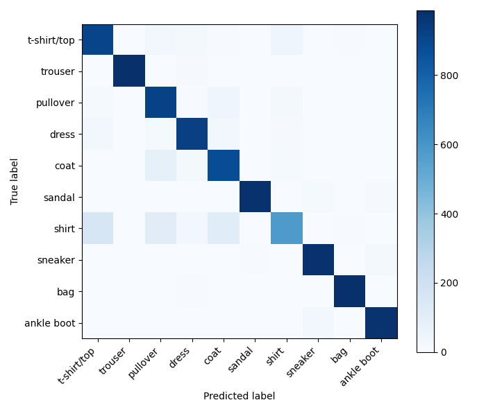
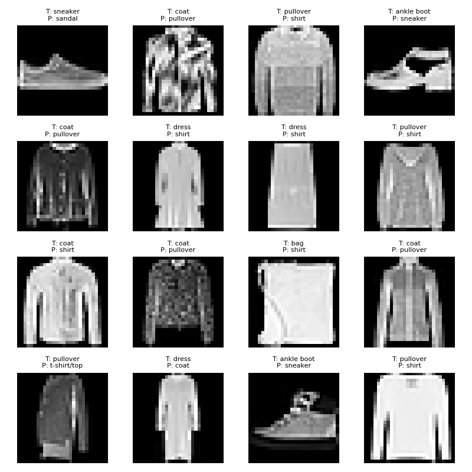
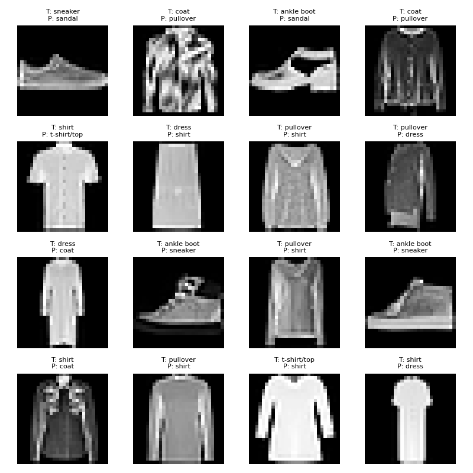
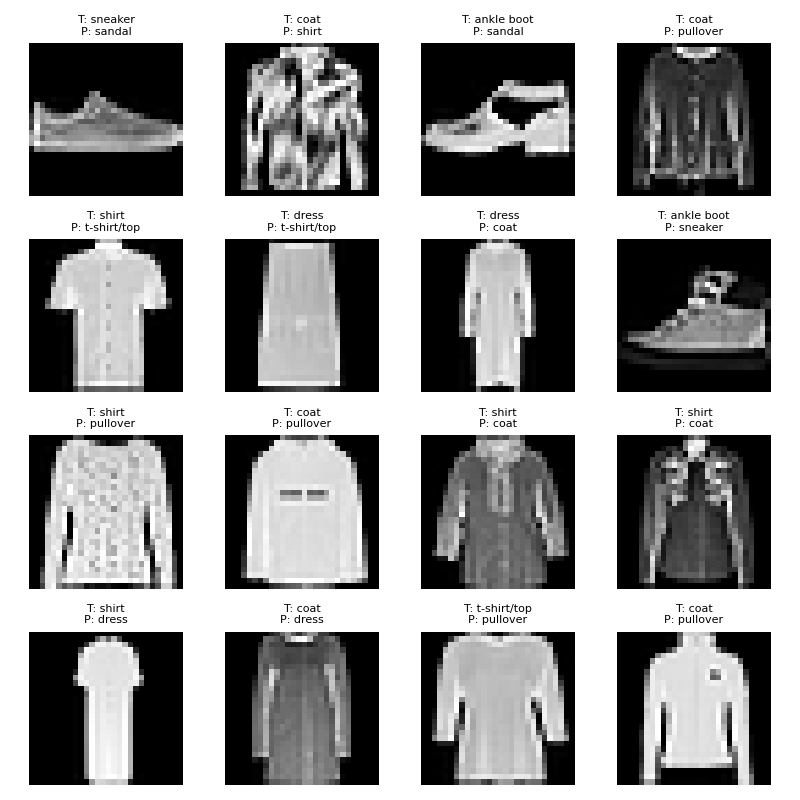

# E1 — Phân tích kết quả thực nghiệm

## 1. So sánh định lượng các mô hình

Trong bài thực nghiệm E1, ba mô hình phân loại ảnh được đánh giá và so sánh gồm bộ phân loại Softmax, mạng nơ-ron truyền thẳng nhiều lớp (Multilayer Perceptron — MLP) và mạng nơ-ron tích chập (Convolutional Neural Network — CNN).

Các mô hình được so sánh dựa trên độ chính xác trên tập kiểm thử, độ chính xác validation tốt nhất, số lượng tham số và thời gian huấn luyện. Bộ dữ liệu sử dụng là Fashion-MNIST, bao gồm 10 lớp quần áo và phụ kiện.

### 1.1. Kết quả thực nghiệm

| Mô hình | Test accuracy | Best validation accuracy | Số tham số | Thời gian huấn luyện (giây) |
|---|---:|---:|---:|---:|
| Softmax | 84,19% | 85,25% | 7.850 | 118,44 |
| MLP | 87,92% | 88,67% | 109.386 | 118,44 |
| CNN | 91,05% | 92,00% | 50.186 | 122,53 |

*Lưu ý: Các số liệu được lấy từ kết quả thực nghiệm hiện có. Thời gian huấn luyện được làm tròn đến hai chữ số thập phân.*

### 1.2. Nhận xét tổng quan

CNN đạt độ chính xác trên tập kiểm thử cao nhất, ở mức 91,05%, tiếp theo là MLP với 87,92% và Softmax với 84,19%.

So với Softmax, MLP cải thiện độ chính xác kiểm thử 3,73 điểm phần trăm. CNN cải thiện 6,86 điểm phần trăm so với Softmax và 3,13 điểm phần trăm so với MLP.

Xét về số lượng tham số, Softmax có cấu trúc nhỏ nhất với 7.850 tham số. MLP có 109.386 tham số, trong khi CNN có 50.186 tham số. Như vậy, CNN đạt độ chính xác cao hơn MLP dù sử dụng ít tham số hơn trong cấu hình thực nghiệm này.

Về thời gian huấn luyện, Softmax và MLP mất khoảng 118,44 giây, còn CNN mất khoảng 122,53 giây. CNN có thời gian huấn luyện dài hơn một chút trong lần chạy hiện tại.

## 2. Phân tích đường cong huấn luyện

Đường cong huấn luyện giúp quan sát sự thay đổi của loss và accuracy trên tập training và validation qua 10 epoch. Qua đó, có thể đánh giá xu hướng hội tụ và nhận diện các dấu hiệu có thể liên quan đến overfitting.

### 2.1. Mô hình Softmax

*Hình 1. Training loss, validation loss và accuracy của mô hình Softmax.*

Training loss giảm từ khoảng 0,61 xuống 0,40. Validation loss cũng giảm từ khoảng 0,50 xuống 0,43. Đồng thời, training accuracy tăng lên khoảng 86%, trong khi validation accuracy đạt khoảng 85%.

Hai đường accuracy tương đối gần nhau và validation loss nhìn chung giảm qua các epoch. Điều này cho thấy mô hình học được các đặc trưng hữu ích mà chưa xuất hiện dấu hiệu overfitting rõ rệt trong quá trình được quan sát.

Tuy nhiên, validation loss giảm chậm hơn training loss ở giai đoạn sau, cho thấy việc cải thiện trên tập validation có xu hướng chậm lại.

### 2.2. Mô hình MLP

*Hình 2. Training loss, validation loss và accuracy của mô hình MLP.*

Training loss giảm liên tục từ khoảng 0,56 xuống 0,25. Training accuracy tăng lên khoảng 91%. Trong khi đó, validation loss giảm trong phần lớn quá trình nhưng dao động ở các epoch cuối; validation accuracy cũng có những giai đoạn giảm nhẹ trước khi phục hồi.

Khoảng cách giữa training accuracy và validation accuracy tăng dần về cuối quá trình. Đây là dấu hiệu cho thấy MLP có thể bắt đầu overfit: hiệu quả trên dữ liệu training tiếp tục được cải thiện nhưng hiệu quả trên validation không tăng tương ứng.

Dù vậy, validation accuracy vẫn cao hơn Softmax, cho thấy MLP có khả năng phân loại tốt hơn trong thực nghiệm này.

### 2.3. Mô hình CNN

*Hình 3. Training loss, validation loss và accuracy của mô hình CNN.*

Training loss giảm từ khoảng 0,50 xuống 0,16, trong khi training accuracy tăng lên khoảng 94%. Validation accuracy đạt mức cao nhất khoảng 92% ở epoch 7, sau đó giảm ở epoch 8 và phục hồi ở epoch 9.

Validation loss nhìn chung giảm, nhưng có dao động ở giai đoạn cuối. Khoảng cách giữa training accuracy và validation accuracy cũng thể hiện rõ hơn so với Softmax.

Những quan sát này gợi ý CNN có thể xuất hiện overfitting nhẹ ở các epoch cuối. Tuy nhiên, CNN vẫn đạt validation accuracy cao nhất trong ba mô hình được so sánh.

### 2.4. So sánh đường cong huấn luyện

Cả ba mô hình đều có xu hướng hội tụ khi training loss giảm và training accuracy tăng qua các epoch. Tuy nhiên, mức độ cải thiện trên tập validation khác nhau.

Softmax có khoảng cách training–validation tương đối nhỏ nhưng độ chính xác thấp nhất. MLP cải thiện độ chính xác nhưng thể hiện sự chênh lệch rõ hơn giữa hai tập dữ liệu. CNN đạt validation accuracy cao nhất, đồng thời có khoảng cách training–validation đáng chú ý ở giai đoạn cuối.

Nhìn chung, kết quả cho thấy CNN học được các đặc trưng có ích cho bài toán phân loại ảnh. Tuy nhiên, việc xác định mô hình có overfit ở mức độ nào cần dựa thêm vào kết quả định lượng từng epoch và các lần thử nghiệm bổ sung.

## 3. Phân tích ma trận nhầm lẫn

Ma trận nhầm lẫn (confusion matrix) được sử dụng để đánh giá khả năng phân loại từng lớp. Các phần tử trên đường chéo chính biểu thị số mẫu được phân loại đúng, trong khi các phần tử ngoài đường chéo biểu thị số mẫu bị phân loại nhầm.

### 3.1. Ma trận nhầm lẫn của Softmax

*Hình 4. Ma trận nhầm lẫn của mô hình Softmax.*

Đường chéo chính của ma trận có màu đậm ở nhiều lớp, cho thấy mô hình phân loại đúng phần lớn mẫu dữ liệu. Tuy nhiên, một số nhầm lẫn xuất hiện giữa các lớp trang phục có hình dạng tương đồng.

Đáng chú ý, các lớp T-shirt/top, shirt, pullover và coat có những ô ngoài đường chéo thể hiện sự nhầm lẫn. Đây có thể là kết quả của việc các lớp này có đặc trưng hình dạng tổng thể tương tự khi biểu diễn dưới dạng ảnh grayscale có độ phân giải thấp.

### 3.2. Ma trận nhầm lẫn của MLP

*Hình 5. Ma trận nhầm lẫn của mô hình MLP.*

MLP cũng có đường chéo chính nổi bật, cho thấy khả năng phân loại tương đối tốt trên phần lớn các lớp. Một số nhầm lẫn giữa T-shirt/top, shirt, pullover và coat vẫn xuất hiện.

So với Softmax, MLP đạt độ chính xác tổng thể cao hơn. Điều này phù hợp với khả năng học các quan hệ phi tuyến thông qua những lớp ẩn. Tuy nhiên, chỉ dựa vào hình ảnh ma trận nhầm lẫn chưa đủ để định lượng chính xác mức giảm lỗi ở từng cặp lớp.

### 3.3. Ma trận nhầm lẫn của CNN

*Hình 6. Ma trận nhầm lẫn của mô hình CNN.*

CNN có đường chéo chính nổi bật và vẫn gặp một số nhầm lẫn giữa các lớp trang phục có hình dạng tương tự, đặc biệt trong nhóm áo.

Kết hợp với test accuracy 91,05%, kết quả cho thấy CNN đạt hiệu quả phân loại tổng thể tốt nhất trong ba mô hình. Các lớp có hình dạng đặc trưng hơn có xu hướng được phân loại dễ dàng hơn, trong khi các lớp có đường viền tương tự vẫn là thách thức đối với mô hình.

### 3.4. So sánh ma trận nhầm lẫn

Cả ba mô hình đều phân loại đúng phần lớn mẫu dữ liệu, nhưng vẫn gặp khó khăn với một số lớp có hình dạng tương tự. Những nhầm lẫn này cho thấy accuracy tổng thể không thể phản ánh đầy đủ hiệu quả của mô hình trên từng lớp.

CNN đạt accuracy cao nhất, phù hợp với nhận xét rằng mô hình có khả năng khai thác cấu trúc không gian của ảnh tốt hơn trong thực nghiệm này. Tuy nhiên, để xác định chính xác những lớp được cải thiện nhiều nhất, cần so sánh các giá trị số trong từng ma trận nhầm lẫn thay vì chỉ dựa vào màu sắc.

## 4. Phân tích các trường hợp dự đoán sai

Để tìm hiểu sâu hơn về hạn chế của từng mô hình, chúng tôi quan sát trực quan các ảnh bị phân loại sai bởi Softmax, MLP và CNN trên bộ dữ liệu Fashion-MNIST. Mỗi ảnh được hiển thị cùng nhãn thực tế (T — True label) và nhãn dự đoán (P — Predicted label).

### 4.1. Các dạng lỗi phổ biến

Qua các ví dụ được hiển thị, có thể nhận thấy một số nhóm lỗi nổi bật.

**Nhầm lẫn giữa các loại áo**

Các mô hình thường nhầm lẫn giữa T-shirt/top, shirt, pullover và coat. Ví dụ, một số ảnh có nhãn thực tế là shirt được dự đoán thành T-shirt/top, pullover hoặc coat. Tương tự, một số ảnh coat bị dự đoán thành pullover hoặc shirt.

Các lớp này có hình dáng tổng thể và đường viền tương đối giống nhau khi biểu diễn dưới dạng ảnh grayscale có độ phân giải thấp. Sự khác biệt về cổ áo, tay áo, hàng cúc và cấu trúc trang phục có thể không đủ rõ để mô hình phân biệt chính xác.

**Nhầm lẫn giữa các loại giày dép**

Một số ảnh sneaker hoặc ankle boot bị dự đoán thành sandal và ngược lại. Chẳng hạn, trong các ví dụ được cung cấp, có ảnh sneaker bị dự đoán thành sandal và ảnh ankle boot bị dự đoán thành sneaker.

Các lỗi này cho thấy những đặc trưng hình dạng tổng thể có thể chưa đủ để phân biệt một số loại giày dép trong ảnh có độ phân giải thấp.

**Nhầm lẫn giữa dress và các loại áo hoặc coat**

Một số ảnh dress bị dự đoán thành T-shirt/top, shirt hoặc coat. Các lỗi này có thể liên quan đến hình dáng thân áo, độ dài trang phục và sự tương đồng của đường viền trong ảnh.

### 4.2. So sánh lỗi giữa ba mô hình

**Softmax**

*Hình 7: các hình ảnh dự đoán sai của Softmax*

Các ví dụ dự đoán sai của Softmax thể hiện nhầm lẫn giữa nhiều lớp trang phục, đặc biệt là shirt, T-shirt/top, pullover, coat và dress. Mô hình cũng nhầm lẫn một số mẫu sneaker và ankle boot với sandal.

Những lỗi này phù hợp với hạn chế của bộ phân loại tuyến tính khi ảnh đầu vào được làm phẳng thành vector. Mô hình không trực tiếp khai thác cấu trúc không gian cục bộ của ảnh như mạng tích chập.

**MLP**

*Hình 8: Các hình ảnh dự đoán sai của MLP*

MLP vẫn mắc các lỗi tương tự, nhất là giữa coat, pullover, shirt và dress. Một số mẫu giày dép cũng bị nhầm lẫn giữa sneaker và sandal.

Mặc dù MLP có khả năng học các quan hệ phi tuyến thông qua các lớp ẩn, các ví dụ cho thấy mô hình vẫn gặp khó khăn khi các lớp có hình dáng tương đồng. Việc tăng khả năng biểu diễn không bảo đảm tất cả các lỗi phân loại sẽ được loại bỏ.

**CNN**

*Hình 9: Các hình ảnh dự đoán sai của CNN*

Các ví dụ dự đoán sai của CNN cũng cho thấy sự nhầm lẫn giữa shirt, T-shirt/top, pullover, coat và dress. Ngoài ra, một số mẫu sneaker hoặc ankle boot vẫn bị phân loại thành sandal hoặc sneaker tương ứng.

Điều này cho thấy CNN cải thiện hiệu quả phân loại tổng thể nhưng vẫn có những giới hạn đối với các mẫu khó phân biệt. Khả năng học đặc trưng không gian giúp ích cho bài toán phân loại ảnh, nhưng không bảo đảm mọi mẫu có hình dạng tương tự đều được phân loại chính xác.

### 4.3. Liên hệ với kết quả định lượng

Kết quả test accuracy của ba mô hình lần lượt là 84,19% đối với Softmax, 87,92% đối với MLP và 91,05% đối với CNN.

Các ảnh dự đoán sai bổ sung thông tin trực quan cho những số liệu này. Chúng cho thấy lỗi không chỉ xuất hiện ngẫu nhiên mà còn tập trung ở những lớp có đặc điểm hình dạng tương đồng.

Tuy nhiên, các hình ảnh được cung cấp chỉ minh họa một tập hợp các trường hợp sai, không thể hiện toàn bộ lỗi của mỗi mô hình. Vì vậy, không thể chỉ dựa trên số ảnh trong hình để kết luận mô hình nào có ít lỗi hơn theo tỷ lệ. Muốn so sánh chính xác, cần tính tổng số mẫu dự đoán sai trên cùng tập test và đối chiếu các giá trị trong confusion matrix.

### 4.4. Kết luận

Phân tích các trường hợp dự đoán sai cho thấy cả ba mô hình đều gặp khó khăn với những lớp trang phục có hình dáng tương đồng, đặc biệt là shirt, T-shirt/top, pullover và coat. Một số lỗi cũng xuất hiện giữa các loại giày dép.

Softmax có hạn chế do mô hình tuyến tính không trực tiếp khai thác cấu trúc không gian của ảnh. MLP có khả năng biểu diễn phi tuyến mạnh hơn nhưng vẫn nhầm lẫn các lớp tương tự. CNN đạt độ chính xác tổng thể cao nhất trong thực nghiệm, song vẫn mắc một số lỗi trên các mẫu khó phân biệt.

Những quan sát này củng cố kết luận rằng việc đánh giá mô hình cần kết hợp accuracy, số lượng tham số, đường cong huấn luyện, confusion matrix và phân tích ảnh dự đoán sai thay vì chỉ dựa vào một chỉ số duy nhất.

## 5. Thảo luận và đánh đổi giữa các mô hình

### 5.1. Độ chính xác và độ phức tạp mô hình

Softmax có số lượng tham số nhỏ nhất, phù hợp khi ưu tiên sự đơn giản. Tuy nhiên, mô hình đạt test accuracy thấp nhất, ở mức 84,19%.

MLP cải thiện test accuracy lên 87,92%, nhưng có số lượng tham số lớn nhất với 109.386 tham số. Việc bổ sung các lớp ẩn cho phép mô hình học các quan hệ phi tuyến, song không trực tiếp khai thác cấu trúc không gian cục bộ của ảnh như CNN.

CNN đạt test accuracy 91,05% với 50.186 tham số. Trong cấu hình thực nghiệm hiện tại, CNN vừa đạt độ chính xác cao nhất vừa sử dụng ít tham số hơn MLP. Các lớp tích chập cho phép mô hình học những đặc trưng không gian cục bộ, có thể góp phần cải thiện khả năng phân loại ảnh.

### 5.2. Khả năng tổng quát hóa

Các đường cong huấn luyện cho thấy cả ba mô hình đều cải thiện trên tập training. Tuy nhiên, validation loss và validation accuracy có dao động ở các epoch cuối, đặc biệt ở MLP và CNN.

Điều này cho thấy việc cải thiện trên tập training không phải lúc nào cũng dẫn đến mức cải thiện tương ứng trên tập validation. Vì vậy, cần lựa chọn mô hình dựa trên hiệu quả validation và đánh giá trên tập test độc lập, thay vì chỉ dựa vào training accuracy.

### 5.3. Chi phí huấn luyện

Thời gian huấn luyện được ghi nhận trong thực nghiệm lần lượt là khoảng 118,44 giây đối với Softmax, 118,44 giây đối với MLP và 122,53 giây đối với CNN.

CNN có thời gian huấn luyện dài hơn một chút trong lần chạy hiện tại. Tuy nhiên, chênh lệch thời gian không lớn so với mức cải thiện accuracy. Các kết quả thời gian này chỉ phản ánh cấu hình và điều kiện thực nghiệm hiện tại, không đại diện cho mọi phần cứng hoặc cách triển khai.

### 5.4. Tổng hợp

| Tiêu chí | Mô hình nổi bật | Nhận xét |
|---|---|---|
| Test accuracy | CNN | Đạt 91,05%, cao nhất trong ba mô hình |
| Ít tham số nhất | Softmax | Chỉ có 7.850 tham số |
| Ít tham số hơn MLP nhưng accuracy cao hơn | CNN | 50.186 tham số và test accuracy 91,05% |
| Thời gian huấn luyện ngắn nhất | Softmax và MLP | Khoảng 118,44 giây trong lần chạy hiện tại |
| Khả năng khai thác đặc trưng không gian | CNN | Kiến trúc tích chập phù hợp với dữ liệu ảnh |

## 6. Kết luận

Trong thực nghiệm E1 trên Fashion-MNIST, ba mô hình Softmax, MLP và CNN cho thấy sự khác biệt về độ chính xác, số lượng tham số, quá trình huấn luyện và dạng lỗi phân loại.

Softmax có cấu trúc đơn giản nhất và số lượng tham số thấp nhất, nhưng đạt test accuracy 84,19%. MLP cải thiện độ chính xác lên 87,92%, đổi lại có số lượng tham số lớn nhất. CNN đạt kết quả tốt nhất với test accuracy 91,05% và 50.186 tham số, ít hơn MLP trong cấu hình được đánh giá.

Các đường cong huấn luyện cho thấy cả ba mô hình đều học được các đặc trưng hữu ích, nhưng MLP và CNN có dấu hiệu chênh lệch giữa hiệu quả trên tập training và validation ở giai đoạn cuối. Ma trận nhầm lẫn cũng cho thấy những lớp trang phục có hình dạng tương tự là nguồn gây lỗi đáng chú ý.

Nhìn chung, CNN là lựa chọn nổi bật nhất trong thực nghiệm hiện tại nếu ưu tiên độ chính xác phân loại và khả năng khai thác đặc trưng không gian của ảnh. Tuy nhiên, Softmax vẫn có lợi thế về sự đơn giản và số lượng tham số. Việc lựa chọn mô hình phù hợp cần cân nhắc đồng thời độ chính xác, độ phức tạp, thời gian huấn luyện và các trường hợp dự đoán sai.

Phân tích trực quan các ảnh dự đoán sai sẽ giúp củng cố kết luận về ưu điểm và hạn chế của từng mô hình, đồng thời cung cấp góc nhìn sâu hơn so với việc chỉ so sánh accuracy tổng thể.